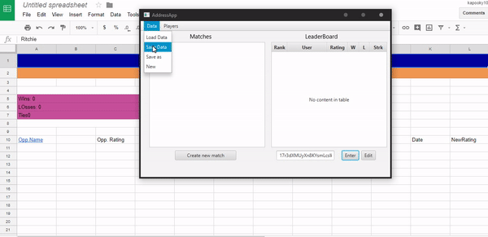

# ELO-League-Management-System
 
<h3>Purpose</h3>
This is a free open-source application designed to help minor E-sports leagues track leaderboard rankings and player stats. The application is capable of supporting up to 5 unique players in 1 match. It uses the ELO rating system, a popular method for calculating the relative skill level of a player.  

<h3>Specs</h3>
<h5>The App's GUI was built with the Javafx library and uses XML to store and load Player objects. Gluon Scene builder was used to construct the view layout.</h5>
<h5> Updated on 26th of October </h5>
<h3>Update- Now integrated with Google Spreadsheets

