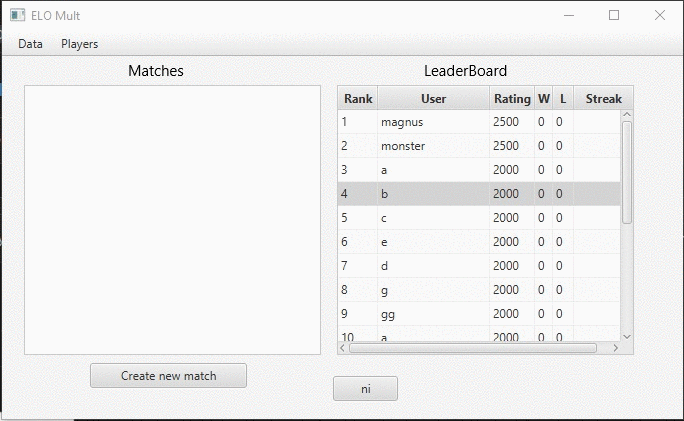

# MultiPlayer-ELO-GUI-Ranking-System
 
<h3>Purpose</h3>

<h3>Specs</h3>
<h5>The App's GUI is built with the Javafx library and uses XML to store and load Player objects.Gluon Scene builder was used to construct the view layout.</h5>

